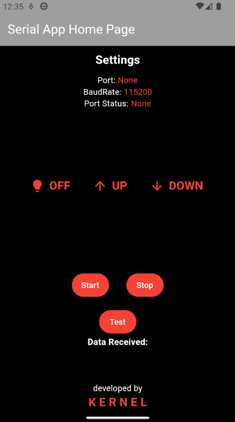

# A Serial Android App
## _Description_
This is an app that is implemented using Flutter framework. It connects an android phone to a microcontroller through UART protocol using a USB TTL. The app's signals are hard-coded based on the functionalities desired in my project. Changing and modifying these signals should be fairly easy.

Keep in mind that this was a very simple application as the intention behind it was to learn flutter's basics and not much was changed nor added to the example project flutter offers. The "ATSTAMP.hex" file is implemented by the same professor who supervised this project and the author of this [Article](https://circuitcellar.com/research-design-hub/mcu-based-ic-links-usb-to-legacy-pc-i-o/), Dr. Hossam Abdelbaki.

The app was used to communicate with an 8051 microcontroller and hence, the "ATSTAMP.hex" was used. The application could still work with any other microcontroller keeping in mind the nature of the signals being sent by the apps. 

## App View

# How to use
The app is fairly straightforward. You should insert the USB TTL into the device first for it to be detected. Open the app, and you should see that the "port" is displaying the port's name and not "None." If "None" still appears, please re-insert the USB TTL. Afterward, click on the Start button, and the connection will begin.

By clicking on any of the three buttons in the center, different signals will be sent through the UART protocol.

Any data received by the app from the microcontroller will be shown under the "Data Received" section. Please note that there is a maximum number of characters that can be displayed at the same time. When the maximum number of characters is reached, it clears the section.

All of the code is implemented in "/serial_app/lib/main.dart". The code is divided and commented on for it to be easy enough to modify.

> Please Ensure that flutter is installed successfully before using pulling this repo.
